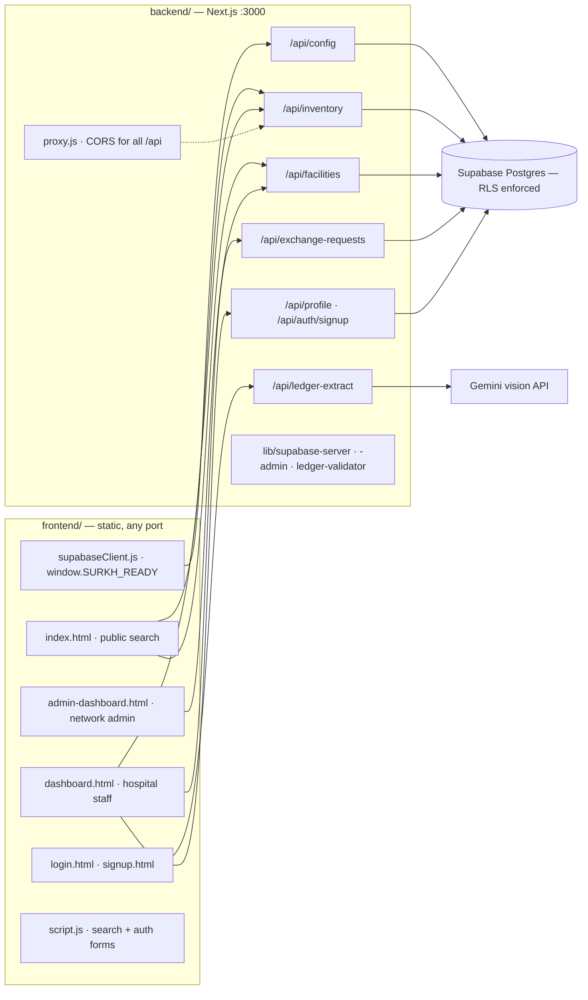
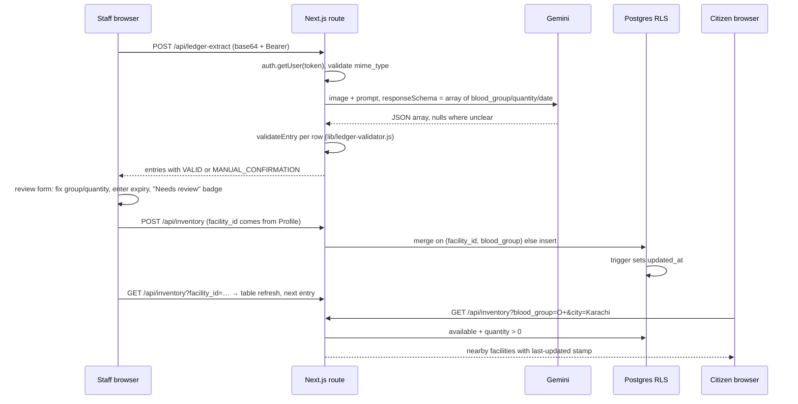
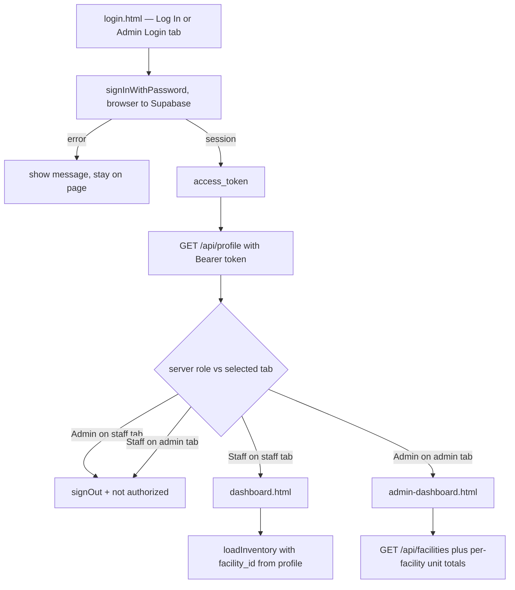

# Surkh (سرخ) — Project Documentation

Pakistan's centralised blood-emergency distribution grid, built for the Bano Qabil AI
Hackathon 2026 (3-person team). Surkh is **connective middleware**, not a blood-bank
management system: it gives citizens real-time visibility into who nearby has a given
blood group, and gives paper-based blood banks a way to become digitally visible without
changing how they work.

**Stack:** static HTML/CSS/JS frontend (no build step) · Next.js 16 App Router API ·
Supabase Postgres + Auth + Row Level Security · Gemini vision for the AI Ledger Reader.

---

## 1. Architecture



### How the three tiers actually talk (the important mechanism)

- **One credential file.** `backend/.env.local` holds `NEXT_PUBLIC_SUPABASE_URL`,
  `NEXT_PUBLIC_SUPABASE_PUBLISHABLE_KEY`, `SUPABASE_SECRET_KEY`, `GEMINI_API_KEY`
  (optional `FRONTEND_ORIGINS`). Nothing in `frontend/` or `backend/app` hardcodes a URL,
  key, or port.
- **Config discovery.** `supabaseClient.js` derives the backend origin from
  `location.hostname:3000` (override: `window.SURKH_BACKEND_URL` or `?backend=`), fetches
  `GET /api/config`, and exposes `window.SURKH_READY = { BACKEND_BASE_URL, supabaseUrl,
  client }`. Every consumer `await`s it — the Supabase client does not exist until that
  fetch resolves. `/api/config` also probes the DB and returns `databaseReady`, the single
  diagnostic for a missed migration.
- **Token pass-through, no server session.** Login runs browser → Supabase directly
  (`signInWithPassword` with the publishable key). The resulting access token is forwarded
  as `Authorization: Bearer …` to each route, which re-verifies it with
  `auth.getUser(token)` on a user-scoped server client (`lib/supabase-server.js`). So
  Postgres RLS evaluates real user claims on every query.
- **CORS is owned by `proxy.js`** (Next 16's rename of `middleware.js`; having both is a
  boot error E900). It echoes allowlisted origins, 403s unknown preflights, defaults to
  loopback `5500/5501/4321`; `FRONTEND_ORIGINS` **replaces** that list. No route handler
  sets CORS headers.

---

## 2. Data model

Postgres on Supabase. Tables are PascalCase and **must be double-quoted** in raw SQL.
Authoritative source: `supabase/migrations/20260901000000_init_schema.sql`, with
`20260905000000_reassert_single_source_of_truth.sql` sorting last and overriding the three
legacy migrations. Mirrored in `docs/schema.md`.

| Table | Key fields | Purpose |
| --- | --- | --- |
| `"Facility"` | `id`, `name`, `city`, `location`, **`facility_code`** (unique), `latitude`, `longitude`, `has_emr` | Who is on the grid; `facility_code` is what staff type at signup |
| `"Inventory"` | `facility_id` FK, `blood_group`, `quantity`, `expiry_date`, `status`, `component_type`, `updated_at` | One row per group per facility — the searchable stock |
| `"Profile"` | `id` = `auth.users.id`, `full_name`, `email`, `role` (`Hospital Staff`\|`Admin`), `facility_id` | Server-side identity and role |
| `"Exchange Request"` | `requester_facility_id`, `provider_facility_id`, `blood_group`, `quantity`, `status` (`pending`→`accepted`/`rejected`), `requested_by` | Inter-facility stock transfer |

**Invariants the code depends on**

- Unique index `inventory_facility_group_idx (facility_id, blood_group)` — lets
  `POST /api/inventory` *merge* stock instead of duplicating rows.
- Trigger `inventory_touch` (before update) sets `updated_at = now()`. No route writes it;
  every "last updated" badge in the UI reads it.
- `SECURITY DEFINER` helpers, both pinned `set search_path = public`: `is_admin()` and
  `my_facility_id()` — these scope every staff row policy.
- RLS is **ENABLED, not FORCED**, so `service_role` still bypasses it (signup inserts
  `Profile` with the admin client). There are **no DELETE policies or grants** — no code
  path deletes, by design.
- `"Profile"` cannot be seeded (FK to `auth.users`); accounts come from
  `POST /api/auth/signup` only.

| Table | anon / public | authenticated staff | admin |
| --- | --- | --- | --- |
| Facility | SELECT all | — | + INSERT / UPDATE |
| Inventory | SELECT all (search is intentionally open) | INSERT / UPDATE **own facility only** | any row |
| Profile | sees **0 rows** (grant, no policy) | own row | all rows |
| Exchange Request | — | SELECT if own facility is either side; INSERT as requester | UPDATE as provider |

---

## 3. API surface

All responses are JSON; all authenticated routes use the same `extractBearerToken()`
exported from `app/api/inventory/route.js`.

| Route | Verbs | Behaviour worth knowing |
| --- | --- | --- |
| `/api/config` | GET (public) | Publishable values only; never reads secret/Gemini keys; `no-store` |
| `/api/facilities` | GET, POST, PATCH | GET also feeds the search page's city dropdown. POST relies on RLS (`42501` → 403). PATCH does an **application-level** `role === 'Admin'` check then writes with the admin client, because `Facility` has no usable UPDATE path for staff |
| `/api/inventory` | GET, POST, PATCH | GET is **two modes in one**: public search (`status='available' AND quantity>0`, filters `blood_group`, `city` via `Facility!inner`) vs dashboard (`?facility_id=` requires a Bearer token whose Profile owns that facility, or Admin, and returns *all* rows including zeros). POST rejects any client-supplied `facility_id`, takes it from Profile, and merges (`quantity` summed, later expiry kept, status recomputed). PATCH never touches `facility_id`; RLS refusal surfaces as 403 via the `PGRST116` coercion error |
| `/api/exchange-requests` | GET, POST, PATCH | GET returns rows and RLS scopes them; the dashboard filters to incoming (`provider_facility_id === my facility`). POST sets `requester_facility_id`/`requested_by`/`status` server-side and blocks self-requests. PATCH `?id=` is provider-only, pending-only, `accepted|rejected` only |
| `/api/profile` | GET (Bearer) | `role`, `facility_id`, `Facility.name` (fetched separately — embedding breaks `.single()`). This is the only role the frontend trusts; login refuses admin-on-staff and staff-on-admin |
| `/api/auth/signup` | POST (public) | Validates `facility_code` against the DB, rejects client-supplied `role`/`facility_id`, creates the auth user then the Profile, and **deletes the auth user if the Profile insert fails**. Reserved code `SURKH-ADMIN` mints an Admin with `facility_id: null`, gated to non-production |
| `/api/ledger-extract` | POST (Bearer) | `{ image_base64, mime_type }` → Gemini → `entries[]`, each with a `validation` object |

---

## 4. The main workflow loop (AI Ledger Reader → citizen search)

This is the project's core contribution: a photograph turns into a searchable,
RLS-scoped inventory row in four hops, with a human in the middle.



Validation is deliberately **never a hard reject** — anything suspicious degrades to
`MANUAL_CONFIRMATION` so a person decides. `ai/validator.js` (and its backend copy) checks:
the 8 valid groups, integer quantity ≥ 0, real `YYYY-MM-DD` date, presence of all three
keys, and flags quantity > 20 as "unusually high". Multi-entry photos are paged: each
confirmed entry is POSTed and spliced out of state until the panel is empty.

### Login and role routing loop



### Supporting loops

1. **Public search** — pick group + city (or live GPS via `navigator.geolocation`,
   reverse-mapped to the nearest entry in `CITY_COORDS`) → grouped-by-facility result
   cards → "Reserve Blood" opens a modal that hands off to WhatsApp via a `wa.me` link.
   **No reservation is persisted** — the grid is visibility only.
2. **Onboarding** — an admin registers a facility (`POST /api/facilities`) → staff
   self-serve at `signup.html` with its `facility_code` → `login.html` → `dashboard.html`,
   which resolves identity from `/api/profile` and renders only that facility's stock.
3. **Manual stock edit** — rows are editable in place; each change PATCHes
   `/api/inventory` with a status derived from `computeStockTier()`
   (`0 → not available`, `≤10 → low`, else `available`). Manual Entry POSTs a pending row;
   this is the fallback when Gemini is unavailable.
4. **Exchange** — a shortage facility files a request; the provider sees it under
   Notifications → Live Requests and accepts/rejects; settled items move to History.
5. **Admin** — `admin-dashboard.html` lists every facility with real total units (it fans
   out `GET /api/inventory?facility_id=N` per facility), expands to per-group stock, and
   creates/updates facilities.

---

## 5. The `ai/` package

A standalone CommonJS prototype, not a runtime service: `index.js` reads
`test-ledger.jpeg`, calls Gemini with the same prompt/`responseSchema` the backend uses,
and prints parse + validation results; `validator.js` holds the rules; `npm test` runs
`test-validator.js`. The shipped path re-implements it as
`backend/lib/ledger-validator.js` (ported verbatim — **two copies, keep in sync**) so the
backend is self-contained and the Gemini key stays server-side.

---

## 6. Provision and run

| Requirement | Why |
| --- | --- |
| Node.js 20.9+ | Next 16 declares `engines.node >= 20.9.0` |
| Docker Desktop running | `db reset` replays migrations in a local Postgres 17 container, then restores into the linked project |
| A Supabase project | free tier; URL + keys → `.env.local`, ref → `db:link` |
| Python 3 | only to serve the static frontend |

```powershell
cd backend
npm install                                   # also installs the Supabase CLI
Copy-Item ../.env.example .env.local          # then fill in the 4 values
npm run db:link -- --project-ref <REF>        # interactive login + DB password
npm run db:reset -- --linked                  # DESTRUCTIVE: migrations + seed.sql
npm run dev                                   # :3000

cd ../frontend
python -m http.server 4321                    # :4321
curl http://localhost:3000/api/config         # expect "databaseReady": true
```

**`db:push` vs `db:reset`** — `db:push` applies migrations only and never runs `seed.sql`,
so you get the 3 demo facilities inserted inline by the init migration
(`KHI-001`, `LHR-001`, `PES-001`). `db:reset -- --linked` additionally loads `seed.sql`:
30 facilities across 10 cities with codes `FAC-001 … FAC-030` and 100 inventory rows
(it deletes the 3 init facilities first so identity PKs don't collide, uses
`OVERRIDING SYSTEM VALUE`, and `setval`s both sequences so later inserts don't clash).

**Demo entry points:** sign up with `FAC-001` → staff dashboard; sign up with
`SURKH-ADMIN` then **Admin Login** → network dashboard (dev build only).

---

